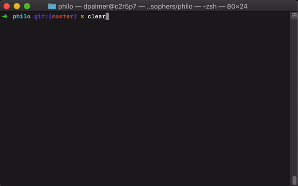

# push_swap


## 🤓 Overview
Who Knew Philosophy Could be so Deadly?

As an aspiring philosopher, there is nothing more I would like to do than spend all of my time eating, thinking, and sleeping. I'm getting pretty close...

This was the first adventure in multithreading, mutexes, and the joys of data races. [Here is a breakdown](https://docs.oracle.com/cd/E60778_01/html/E60750/gepdy.html#scrolltoc) of how Oracle approached the problem, but it should be noted that they did it in a simplistic way that does not scale, nor is it portable. Basically, they side-stepped the issue by having half of the philosophers pause for a few milliseconds. Seems like cheating to me. Also, look at that IDE! What is that, Windows 7?

## 🧐 So What's the Deal?
- **`Each philosopher has a fork`** since that's all they can afford.
- **`But, they need two forks to eat`** for maximum face-stuffing.
- **`So they use their neighbor's fork`** because hygiene.

The trick here is to allocate forks in such a way so that the philosophers don't all hold on to one fork, never grab a second fork, and all starve to death. (Which is funny, but wrong 🙄). Also, the philosophers don't talk to each other. And there cannot be data races (for non-nerds, that means you cannot be updating a value at the same time it's being read by another thread. In a real life scenario this can be disasterous. Here it's just mildly annoying).

## 📷 Preview
Here is a visual representation of what the program does.



## 💻 Compilation
To compile:

```make```

Remove the object files:

```make clean```

Remove everything:

```make fclean```

## 🤡 Usage
The program takes the following arguments:

**`./philo [# of philos] [time to die] [time to eat] [time to sleep]`** and an optional *```[how many times to eat]```*

If you don't tell the philosophers to stop eating after N number of meals, they'll continue to gorge themselves in perpetuity.

`Just like I do.`

The program will take up to 250 philosophers, but you will notice that there will start to be some time-slippage that results from the computer hardware starting to fall behind when starting/pausing/evaluating threads. It's slow, but noticeable, and will eventually result in someone starving.

Unless your computer is at NASA or CERN, in which case you can disregard this warning.

### 📝 License
Distributed under the MIT License. See [LICENSE](LICENSE) for more information.
